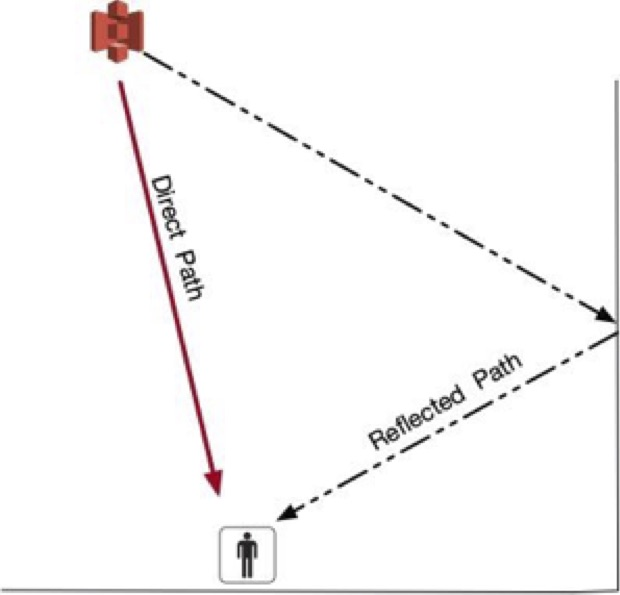

Ultrawide Band[1](#f1)

Ultrawide band (UWB) signal research is both old and new. Whole experimenting in 1887, Hertz generated the first UWB signals. Hertz created sparks that were radiated though wide-band loaded dipoles. In this time period, short, wide-band pulses were the easiest to create (Win, Dardari, Molisch, Wiesbeck, & Jinyun Zhang, 2009). Interest continued in UWB though the 1970’s. Research in UWB expanded greatly in 2002. In February 2002, the Federal Communications Commission (FCC) issued the first authorization for UWB (Andrews, 2003). Similar to Bluetooth and BLE, UWB frequencies between 3.1 - 10.6 Ghz are available for unlicensed use (Win et al., 2009).

As noted previously, the 2002 FCC decision regarding UWB spectrum has created renewed interest in UWB research. Research interest has not translated to significant consumer adoption. It should be noted that unlike BLE, UWB has not become a common place technology. UWB lacks the standard specifications of BLE. This has hampered the broad consumer adoption of the technology (Zafari, Gkelias, & Leung, 2017).

Some of the advantages of UWB (Ridolfi, Van de Velde, Steendam, & De Poorter, 2018) include:

- bandwidth is over 110 Mbps (up to 480 Mbps)
- Low Cost, Low Power
- Large bandwidth and the high time resolution

Of particular interest to IoT and Industry 4.0 research is the large bandwidth and the high time resolution. This feature can mitigate indoor environmental factors such as non-line-of-sight reception, multipath, and multiple access interference. Non-line-of-sight reception is due to UWB being able to penetration through obstacles. The penetration is due to the fact that UWB has large frequency spectrum that includes low frequency parts as well as high frequency components (Gezici and Poor, 2009, #97855).

Multipath (Figure 1) is a common issue when working with GPS systems. Multipath can be defined as:

>“The term multipath is derived from the fact that a signal transmitted from a GPS satellite can follow a ‘multiple’ number of propagation ‘paths’ to the receiving antenna. This is possible because the signal can be reflected back to the antenna off surrounding objects, including the earth’s surface.”

Figure 1: Multipath Example

GPS measurements (as with UWB) are based on the transmission speed and accurate timekeeping. Signals experiencing multipath are measuring the signal assuming that the signal is traveling in the straight path to the receiver. In actuality, the signal is following the reflected path. This introduces error into the position calculations. The very wide bandwidth and pulses used be UWB mitigate the effects of a dense multipath environments, such as indoors (Win & Scholtz, 1998).

UWB is resistant to multiple access interference. This is interference from other UWB and electronic signals. The very small power spectral densities of UWB reduces the impact of interference (Hu & Beaulieu, 2004).

The main disadvantages to UWB include (Kshetrimayum, 2009):

- Interference
- Complex signal processing
- Bit synchronization time

Although UWB is resistant to outside interference, it has the potential to interfere with other electronic signals. WLAN devices working at 5.150–5.825 GHz and 2.4 GHz industrial, scientific, and medical bands are potentially susceptible (Kshetrimayum, 2009). Particularly in a noisy environment, complex signal processing is required by UWB. This processing allows a UWB device to be able to recover data. UWB signals are transferred in pulses. These pulses occur in extremely rapid succession. With intermittent transmission, performance can be significantly impacted (Kshetrimayum, 2009).

<b id="f1">1</b> In this document, I use the term Ultrawide Band. In the literature, it is also referred to as Ultra Wide Band, Ultra Wideband, Ultra-Wide Band, Ultra-Wideband, and several other derivations. I use Ultrawide band as synonymous.[↩](#a1)

References:

Andrews, J. R. (2003). UWB signal sources, antennas and propagation. public.hofstragroup.com, 15, 439-440.

Hu, B., & Beaulieu, N. C. (2004). Accurate evaluation of multiple-access performance in TH-PPM and TH-BPSK UWB systems. IEEE Transactions on communications, 52(10), 1758-1766.

Kshetrimayum, R. S. (2009). An introduction to UWB communication systems. IEEE Potentials, 28(2), 9-13.

Ridolfi, M., Van de Velde, S., Steendam, H., & De Poorter, E. (2018). Analysis of the Scalability of UWB Indoor Localization Solutions for High User Densities. Sensors (Basel, Switzerland), 18(6).

Win, M. Z., Dardari, D., Molisch, A. F., Wiesbeck, W., & Jinyun Zhang, W. (2009). History and applications of UWB. dspace.mit.edu.

Win, M. Z., & Scholtz, R. A. (1998). On the robustness of ultra-wide bandwidth signals in dense multipath environments. IEEE Communications letters, 2, 51-53.

Zafari, F., Gkelias, A., & Leung, K. (2017). A survey of indoor localization systems and technologies. arXiv preprint arXiv:1709.01015.

Photo by [Enrique Alarcon](https://unsplash.com/@qikealarcon?utm_source=unsplash&utm_medium=referral&utm_content=creditCopyText) on [Unsplash](https://unsplash.com/search/photos/iphone-map?utm_source=unsplash&utm_medium=referral&utm_content=creditCopyText)
